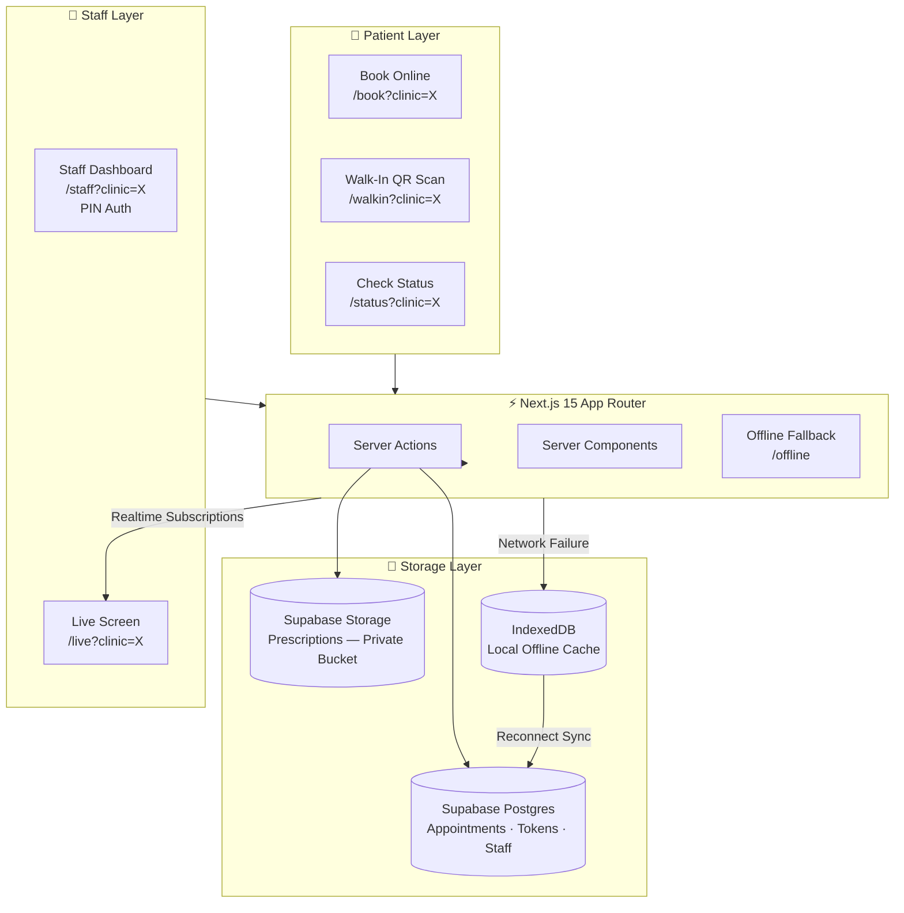

<div align="center">

# 🏥 Clinic OS

### Multi-Tenant Healthcare Queue Management System

**Production-deployed. Offline-first. Built for India.**

[](https://nextjs.org/)
[](https://www.typescriptlang.org/)
[](https://supabase.com/)
[](https://tailwindcss.com/)
[](https://web.dev/progressive-web-apps/)
[](https://clinic-os-inky.vercel.app)
[](LICENSE)

[**Live Demo →**](https://clinic-os-inky.vercel.app)

</div>

---

## 🎯 The Problem

India's tier-2/3 city clinics operate on **pen-and-paper queues**. Patients arrive, write their name in a register, and wait — sometimes 2–3 hours — with no visibility into how long they'll wait. Doctors have no digital tools to manage their daily flow. Staff juggle phone calls, walk-ins, and bookings manually.

**Clinic OS** replaces the register.

---

## ✨ What It Does

A single codebase powers **three independent clinics** simultaneously:

| Clinic | Type | URL Parameter |
|--------|------|---------------|
| Dr. Satta Ram Panwar | General Surgery | `?clinic=surgery` |
| Dhandev Dental Clinic | Dental | `?clinic=dental` |
| Associated Pharmacy | Pharmacy | `?clinic=pharmacy` |

**Patient Flows:**
- 📅 **Book online** — appointment with date/time slot selection
- 📱 **Walk-in via QR** — scan a QR code at clinic, get a token instantly (no app download)
- 🔍 **Track queue status** — search by mobile number to see position + estimated wait

**Staff Flows:**
- 🖥️ **Staff Dashboard** — next / hold / skip / reschedule actions
- 📺 **Live Waiting Room Screen** — real-time display for the waiting area TV
- 🧾 **Prescription Upload** — store to private Supabase Storage bucket

---

## 🏗️ System Architecture



### Key Technical Decisions

| Decision | Rationale |
|----------|-----------|
| **Next.js App Router (Server Components)** | Zero-JS patient pages = instant load on 4G/slow connections |
| **URL-param multi-tenancy** (`?clinic=X`) | Single deployment, zero infra overhead per clinic |
| **PIN-based auth** (not OAuth) | Clinic staff are non-technical; PIN is frictionless |
| **IndexedDB offline fallback** | Network cuts mid-form → patient data not lost; syncs on reconnect |
| **Supabase Realtime** | Live queue screen auto-updates without polling |
| **Hindi-first i18n** | Patients in tier-2/3 cities are more comfortable in Hindi |
| **QR tokens (no app install)** | Walk-in patients shouldn't need to download anything |

---

## 📁 Project Structure

```
clinic-os/
├── src/
│   ├── app/                    # Next.js 15 App Router
│   │   ├── api/                # Route Handlers (server-side API)
│   │   ├── book/               # Appointment booking flow
│   │   ├── walkin/             # QR walk-in token flow
│   │   ├── status/             # Patient queue status lookup
│   │   ├── staff/              # Staff dashboard (PIN protected)
│   │   ├── live/               # Waiting room display screen
│   │   ├── poster/             # Printable QR poster generator
│   │   ├── offline/            # Offline fallback page
│   │   ├── manifest.ts         # PWA manifest
│   │   └── layout.tsx          # Root layout
│   │
│   ├── components/             # Shared UI components
│   ├── config/                 # Multi-clinic configuration map
│   ├── features/
│   │   └── clinic/             # Feature-sliced domain logic
│   ├── i18n/                   # Hindi/English translations
│   ├── lib/                    # Utilities (cn, formatters, etc.)
│   └── services/               # Business logic & Supabase clients
│
├── supabase/
│   ├── schema.sql              # Full DB schema (run this first)
│   └── seed.sql                # Seed data for local dev
│
├── firestore.rules             # Auth rules
├── next.config.ts
└── tsconfig.json
```

---

## 🔐 Security Architecture

```
Patient Request
      │
      ▼
┌─────────────────────────────────────────────────────┐
│  Next.js Server (Vercel Edge)                       │
│                                                     │
│  ┌──────────────┐    ┌──────────────────────────┐  │
│  │ Public Routes │    │ Protected Routes         │  │
│  │ /book        │    │ /staff — PIN verified     │  │
│  │ /walkin      │    │ server-side via           │  │
│  │ /status      │    │ STAFF_SESSION_SECRET      │  │
│  │ /live        │    │ (httpOnly signed cookie)  │  │
│  └──────────────┘    └──────────────────────────┘  │
│                                                     │
│  SUPABASE_SERVICE_ROLE_KEY — server-only            │
│  Never exposed to client bundle                     │
└─────────────────────────────────────────────────────┘
```

- **No third-party auth SDK** on the client — eliminates entire attack surface
- Service Role Key used **only** in Server Actions, never in client components
- Patient mobile numbers — only used for queue lookup, not stored with PII
- Prescriptions stored in **private bucket** (not publicly accessible URLs)

---

## 🌐 All Routes

| Route | Purpose | Auth |
|-------|---------|------|
| `/` | Multi-clinic home portal | Public |
| `/book?clinic=surgery\|dental\|pharmacy` | Appointment booking | Public |
| `/walkin?clinic=surgery\|dental\|pharmacy` | QR walk-in token | Public |
| `/status?clinic=surgery\|dental\|pharmacy` | Queue status by mobile | Public |
| `/staff?clinic=surgery\|dental\|pharmacy` | Staff management dashboard | PIN |
| `/live?clinic=surgery\|dental\|pharmacy` | Waiting room display | Public |
| `/poster?clinic=surgery\|dental\|pharmacy` | Printable QR poster | Public |
| `/offline` | Offline fallback page | Public |

---

## 🚀 Local Development

### Prerequisites
- Node.js 18+
- A [Supabase](https://supabase.com/) project (free tier works)

### Setup

```bash
# 1. Clone
git clone https://github.com/kuldeeppanwar02/clinic-os.git
cd clinic-os

# 2. Install dependencies
npm install

# 3. Configure environment
cp .env.example .env.local
# Fill in your Supabase credentials (see below)

# 4. Initialize database
# Open Supabase SQL Editor → paste & run supabase/schema.sql
# Then run supabase/seed.sql for sample data

# 5. Start dev server
npm run dev
```

Open [http://localhost:3000](http://localhost:3000)

### Environment Variables

```env
# Public (safe to expose in browser)
NEXT_PUBLIC_SUPABASE_URL=https://your-project.supabase.co
NEXT_PUBLIC_APP_BASE_URL=http://localhost:3000

# Server-only (never expose to client)
SUPABASE_SERVICE_ROLE_KEY=your-service-role-key
SUPABASE_DATABASE_URL=postgresql://...
SUPABASE_STORAGE_BUCKET=prescriptions

# Staff authentication
STAFF_ALLOWED_EMAILS=doctor@example.com
STAFF_SESSION_SECRET=your-secret-min-32-chars

# Clinic PINs (set unique PINs per clinic)
DOCTOR_PIN_SURGERY=0000
DOCTOR_PIN_DENTAL=0000
PHARMACY_PIN=0000
```

---

## 🗄️ Database Setup

The `supabase/schema.sql` file contains the complete schema. Key tables:

| Table | Purpose |
|-------|---------|
| `appointments` | Pre-booked slots with date/time/clinic |
| `tokens` | Walk-in queue tokens |
| `staff` | Staff accounts linked to clinics |
| `prescriptions` | Metadata for uploaded prescription files |

Run in order:
1. `supabase/schema.sql` — Create all tables + RLS policies
2. `supabase/seed.sql` — Add sample staff records

---

## 📦 Tech Stack

| Layer | Technology | Version |
|-------|-----------|---------|
| Framework | Next.js | 15 (App Router) |
| Language | TypeScript | 5 |
| Styling | Tailwind CSS | 4 |
| Database | Supabase Postgres | Latest |
| Storage | Supabase Storage | Latest |
| Icons | Lucide React | 0.475 |
| HTTP Client | Axios | 1.15 |
| Deployment | Vercel | — |

---

## 🌍 Offline Behaviour

The app implements a **graceful degradation** strategy:

1. Patient fills booking/walk-in form
2. On submit → attempt Supabase write
3. **Network failure** → save to `IndexedDB` with status `provisional`
4. Show confirmation with "will sync when online" notice
5. Background sync on reconnect → retry provisional entries
6. If sync succeeds → update status to `confirmed`

This ensures **zero patient data loss** on intermittent connections — critical for clinics on mobile data in rural areas.

---

## 🚢 Deployment

Deployed on Vercel with automatic preview deployments on every push:

```bash
# One-click deploy
vercel --prod
```

Set all environment variables in Vercel project settings → Environment Variables.

---

<div align="center">

**Built with care for India's clinics.**

[Live Demo](https://clinic-os-inky.vercel.app) · [Report Bug](https://github.com/kuldeeppanwar02/clinic-os/issues) · [Request Feature](https://github.com/kuldeeppanwar02/clinic-os/issues)

</div>
